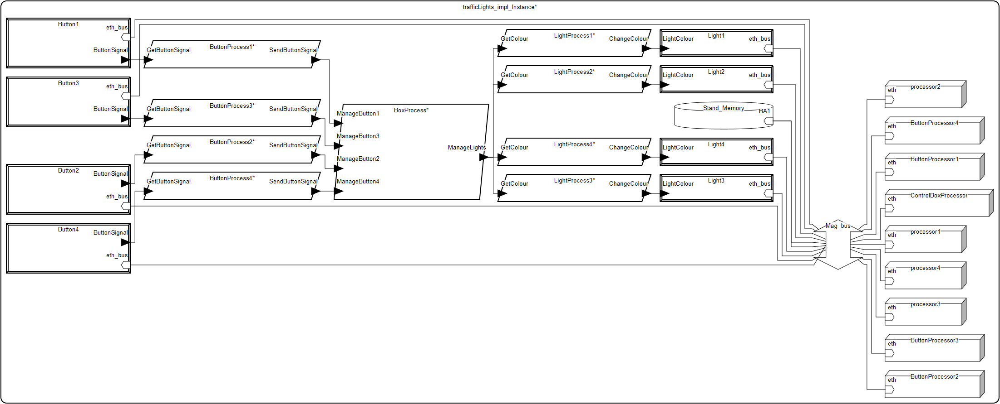

# System-sygnalizacji-czasu-rzeczywistego

## Opis systemu
System regulujący ruch samochodowy na skrzyżowaniu przy użyciu sygnalizacji świetlnej

## Schemat systemu

## Proponowane metody analizy modelu, dostępne w Osate:
* Bound Resource Budget Analysis Report
* Weight totals Report
* Binding Constraints
* Connection binding consistancy

## Spis komponentów:
* Light1 - sygnalizator 1
* Light2 - sygnalizator 2
* Light3 - sygnalizator 3
* Light4 - sygnalizator 4
* Button1 - przycisk przy sygnalizatorze 1
* Button2 - przycisk przy sygnalizatorze 2
* Button3 - przycisk przy sygnalizatorze 3
* Button4 - przycisk przy sygnalizatorze 4
* processor1 - procesor obsługujący dane sygnalizatora świetlnego 1
* processor2 - procesor obsługujący dane sygnalizatora świetlnego 2
* processor3 - procesor obsługujący dane sygnalizatora świetlnego 3
* processor4 - procesor obsługujący dane sygnalizatora świetlnego 4
* ControlBoxProcessor - procesor zarządzający zmianą świateł
* ButtonProcess1 - proces obsługujący logikę biznesową przycisku 1
* ButtonProcess2 - proces obsługujący logikę biznesową przycisku 2
* ButtonProcess3 - proces obsługujący logikę biznesową przycisku 3
* ButtonProcess4 - proces obsługujący logikę biznesową przycisku 4
* LightProcess1 - proces obsługujący logikę biznesową sygnalizatora 1
* LightProcess2 - proces obsługujący logikę biznesową sygnalizatora 2
* LightProcess3 - proces obsługujący logikę biznesową sygnalizatora 3
* LightProcess4 - proces obsługujący logikę biznesową sygnalizatora 4
* BoxProcess - proces obsługujący logikę biznesową zarządzania zmianą koloru sygnalizatorów
* Mag_bus- magistrala łącząca procesor z modułem świateł
* SignalizerColour - obiekt data będący enum stanów sygnalizatora
* StandMemory - pamięć RAM
